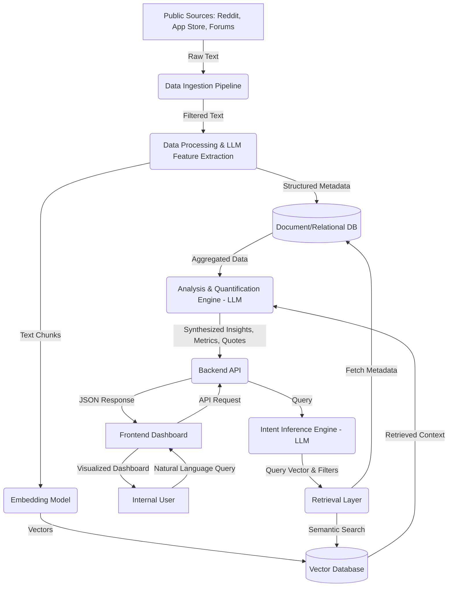

# Architecture Design: AI-Powered Discovery Engine

This document outlines the system architecture for building the **AI-Powered Discovery Engine for Vague Photo Retrieval**, designed to ingest public discourse, analyze photo retrieval friction, and present actionable insights to product teams.

## 1. High-Level Architecture Overview

The system is composed of an asynchronous data pipeline for ingesting and processing public user feedback, and a real-time web application consisting of a frontend dashboard and a backend API powered by a Large Language Model (LLM) and a Vector Database (RAG setup).

### Core Components
1. **Data Ingestion & Processing Pipeline (Asynchronous)**
2. **Vector & Metadata Storage (Persistence Layer)**
3. **Backend API & Orchestration Engine**
4. **AI & Retrieval Engine (LLM + Vector DB)**
5. **Frontend Dashboard & Query Interface**

---

## 2. Technology Stack Recommendations

*   **Frontend**: React (Next.js or Vite) with TailwindCSS, Recharts (for data visualization).
*   **Backend**: Python (FastAPI) - ideal for data processing, LLM orchestration (LangChain/LlamaIndex), and asynchronous tasks.
*   **Database (Vector)**: Pinecone, Weaviate, Qdrant, or PostgreSQL with `pgvector` for semantic search.
*   **Database (Relational/Document)**: PostgreSQL or MongoDB for storing raw data, structured metadata, and application state.
*   **LLM Provider**: Groq (`llama-3.3-70b-versatile`).
*   **Embeddings**: open-source equivalents  BAAI/bge-large-en-v1.5
*   **Data Ingestion Orchestration**: Apache Airflow, Prefect, or simple CRON jobs running Python scripts (Scrapy, Apify).

---

## 3. Detailed Component Breakdown

### 3.1 Data Ingestion Pipeline
*   **Function**: Scrapes and collects data from diverse public sources (App Stores, Reddit, Twitter, Forums).
*   **Process**:
    1.  **Extract**: Connect to public APIs or run web scrapers to gather raw text.
    2.  **Filter**: Use heuristic keyword matching (e.g., "can't find", "search", "old photo", "remember") to isolate relevant threads.
    3.  **Clean**: Remove PII, normalize text, handle missing fields.

### 3.2 Data Processing & Feature Extraction
*   **Function**: Enriches raw data with structured features before embedding.
*   **Process**:
    1.  **LLM Parsing**: Pass raw text through a smaller, cost-effective LLM to extract:
        *   *Target*: What the user was looking for (e.g., receipt, dog, vacation).
        *   *Strategy*: How they tried to find it (e.g., scrolling, keyword guess).
        *   *Emotion*: User sentiment/frustration level.
    2.  **Embedding Generation**: Convert the raw text and extracted features into dense vector embeddings.
    3.  **Storage**: Save the vector embeddings to the Vector Database and the structured metadata to the Document/Relational Database.

### 3.3 Intent Inference Engine (Backend API)
*   **Function**: Acts as the entry point for frontend queries from internal product teams.
*   **Process**:
    1.  Accepts flexible natural language queries.
    2.  Uses an LLM to classify the query into primary inquiry types:
        *   Cognitive Memory & Recall
        *   Search Formulation
        *   Retrieval Breakdown
        *   Comparative Inquiries
        *   Workarounds
    3.  Translates the inferred intent into optimized search queries (dense vectors + metadata filters) for the database.

### 3.4 Integration & Retrieval Layer (RAG)
*   **Function**: Retrieves relevant contextual data based on the processed query.
*   **Process**:
    1.  Performs a semantic search on the Vector Database to find similar conversation clusters.
    2.  Applies metadata filters (e.g., date ranges, source types) if the user query was specific.
    3.  Returns top-K relevant threads and their structured features.

### 3.5 Discovery, Analysis & Quantification Engine
*   **Function**: Synthesizes the retrieved data into human-readable insights and metrics.
*   **Process**:
    1.  Passes the retrieved context (documents + metadata) to a powerful LLM.
    2.  Instructs the LLM to aggregate the structured metadata (e.g., calculating the distribution of failure by content type).
    3.  Instructs the LLM to write qualitative insights, identify root causes, and isolate direct supporting quotes.

### 3.6 Frontend Dashboard (Output Display)
*   **Function**: User interface for querying and visualizing the results.
*   **Features**:
    *   **Search Bar**: For natural language queries.
    *   **Metrics Cards**: Displaying quantified statistics (e.g., 86% forgot exact dates).
    *   **Visualizations**: Pie charts and bar graphs for failure distributions and root causes.
    *   **Insights Panel**: AI-generated textual analysis of the problem.
    *   **Evidence Feed**: A scrollable list of actual user quotes mapped to the identified insights.

---

## 4. System Data Flow

---

## 5. Key API Endpoints (Proposed)

*   `POST /api/query`: 
    *   *Input*: `{ "query": "What do people actually remember about old travel photos?" }`
    *   *Process*: Triggers intent inference, retrieval, and analysis.
    *   *Output*: Returns structured analysis, metrics, and evidence quotes.
*   `GET /api/sources/stats`: 
    *   *Output*: Overall statistics of ingested data (total records, sources distribution).
*   `GET /api/insights/trending`: 
    *   *Output*: Pre-computed top retrieval pain points for the default dashboard view.
